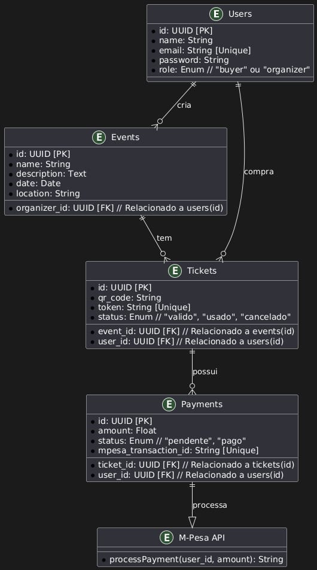

# Ticketing System - Sistema de Venda e Validação de Ingressos

Este é um sistema completo para **compra, gerenciamento e validação de ingressos eletrônicos** para eventos, utilizando **Go (backend)**, **React Native (frontend)** e **PostgreSQL (banco de dados)**, com integração ao **M-Pesa** para pagamentos eletrônicos. O sistema é completamente dockerizado para facilitar a implementação e execução.

---

## 📂 Estrutura do Projeto

```
ticketing-system/
│── backend/        # Backend em Go
│── frontend/       # App React Native
│── docker-compose.yml  # Orquestração Docker
```

---

## ⚡ Requisitos

### 🛠️ Requisitos Mínimos

- Docker e Docker Compose instalados
- Node.js e NPM/Yarn (para o frontend)
- Go instalado (caso rode sem Docker)
- Expo Go (para testar o app no celular)

### 🛠️ Instalação dos Requisitos

#### 🖥️ Windows

```powershell
# Instalar Docker
winget install Docker.DockerDesktop

# Instalar Node.js
winget install OpenJS.NodeJS

# Instalar Go
winget install Golang.Go

# Instalar Expo CLI
yarn global add expo-cli
```

#### 🐧 Linux (Ubuntu/Debian)

```bash
# Instalar Docker
sudo apt update && sudo apt install -y docker.io docker-compose

# Instalar Node.js e npm
sudo apt install -y nodejs npm

# Instalar Go
sudo apt install -y golang-go

# Instalar Expo CLI
npm install -g expo-cli
```

#### 🐧 Linux (Fedora e derivados)

```bash
# Instalar Docker
dnf install -y docker-compose

# Instalar Node.js e npm
dnf install -y nodejs npm

# Instalar Go
dnf install -y golang

# Instalar Expo CLI
npm install -g expo-cli
```

#### 🐧 Linux (Arch e derivados)

```bash
# Instalar Docker
sudo pacman -S docker docker-compose

# Instalar Node.js e npm
sudo pacman -S nodejs npm

# Instalar Go
sudo pacman -S go

# Instalar Expo CLI
npm install -g expo-cli
```

#### 🍏 macOS

```bash
# Instalar Homebrew (se ainda não tiver)
/bin/bash -c "$(curl -fsSL https://raw.githubusercontent.com/Homebrew/install/HEAD/install.sh)"

# Instalar Docker
brew install --cask docker

# Instalar Node.js
brew install node

# Instalar Go
brew install go

# Instalar Expo CLI
npm install -g expo-cli
```

### 🛠️ Dependências

- **Backend:** Go, Gorilla Mux, GORM, JWT, M-Pesa API
- **Frontend:** React Native, React Navigation, Axios, QRCode Scanner, Expo Go
- **Infraestrutura:** Docker

---

## 🔄 Como Rodar o Projeto

### 🛠️ 1. Clonar o repositório:

```bash
git clone https://github.com/seu-usuario/ticketing-system.git
cd ticketing-system
```

### 🛠️ 2. Configurar o `docker-compose.yml` caso necessário:

Se precisar alterar configurações como credenciais do banco de dados ou chaves da API do M-Pesa, edite o arquivo `docker-compose.yml` e ajuste as variáveis de ambiente conforme necessário.

### 🛠️ 3. Rodar o projeto com Docker:

```bash
docker-compose up --build
```

Isso subirá:
✅ Banco de Dados PostgreSQL
✅ API em Go
✅ Frontend React Native

### 🛠️ 4. Acessar o Banco de Dados dentro do contêiner

Caso precise acessar o PostgreSQL diretamente dentro do contêiner, utilize os seguintes comandos:

```bash
# Listar os contêineres em execução
docker ps

# Acessar o contêiner do PostgreSQL
docker exec -it nome-do-container-postgres psql -U usuario -d nome-do-banco
```

Substitua `nome-do-container-postgres`, `usuario` e `nome-do-banco` conforme as credenciais configuradas no `docker-compose.yml`.

### 🛠️ 5. Rodar o aplicativo móvel no Expo Go

Se quiser testar rapidamente no celular sem precisar de um emulador, use o Expo Go:

```bash
cd frontend
expo start
```

Escaneie o QR Code no terminal com o app Expo Go para rodar o app no seu celular.

---

## 🛡️ Segurança do Ticket QR Code

1. **Geração do Token Único:** No momento da compra, um token único é gerado.
2. **Banco de Dados:** O token é salvo junto ao QR Code.
3. **Validação:** Quando escaneado, o sistema verifica o status do ticket.
4. **Uso Único:** Se o ticket já foi usado, retorna um erro e bloqueia a entrada.

---

## 📷 Screenshots

*(Adicione aqui capturas de tela do sistema quando disponíveis.)*

---

## 📊 Diagrama Entidade-Relacionamento (DER)



